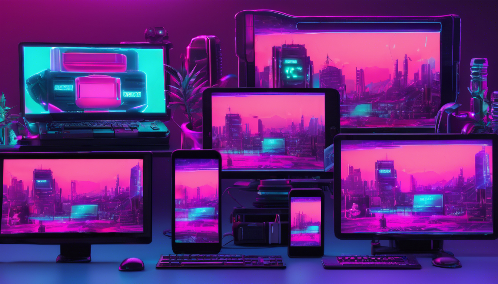

Easy Resolutions for Unity
===

(image generated with [dreamstudio.ai](https://dreamstudio.ai/))

An asset for Unity Game Engine.

Automatically picks the appropriate scene based on the screen resolution.

Can be especially well-suited for 2D games that need to support a wide range of devices with varying scene resolutions, aspect ratios, and memory capacities.

## License

[MIT](LICENSE.md)

## Installation

[Download from Unity Asset Store](http://u3d.as/9aa), or install from GitHub via Unity Package Manager:

Open Unity Package Manager, click the `+` sign, choose `Install package from git URL...` and paste the `https://github.com/marked-one/EasyResolutions.git` url.

Alternatively, you can use the versioned url, e.g. `https://github.com/marked-one/EasyResolutions.git#2.0.0`.

## Getting started

// TODO