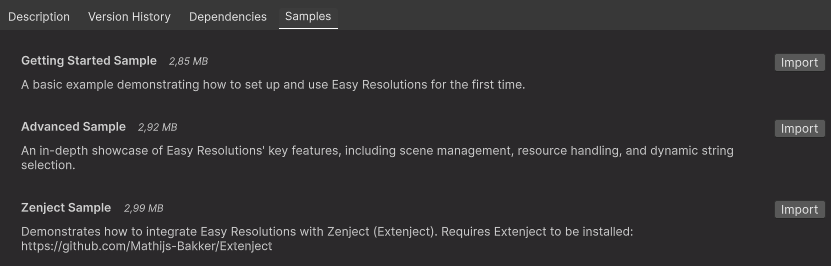
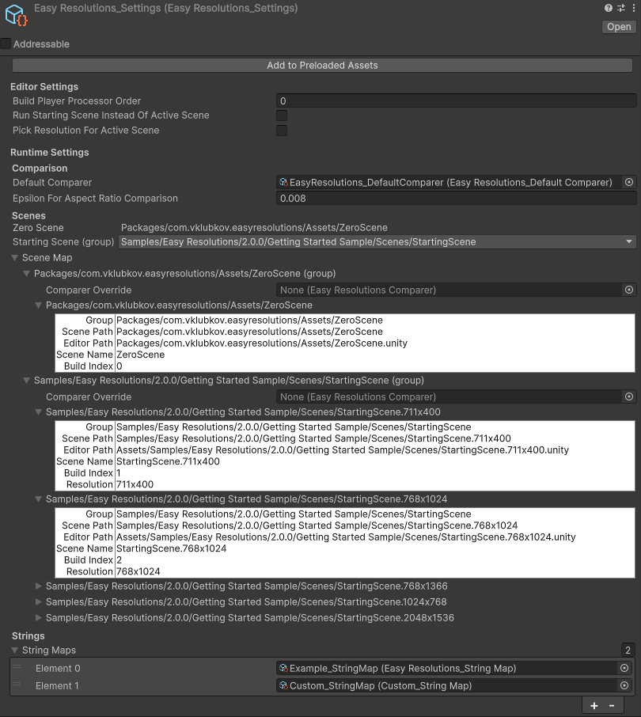
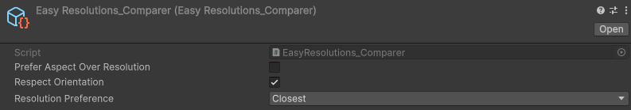
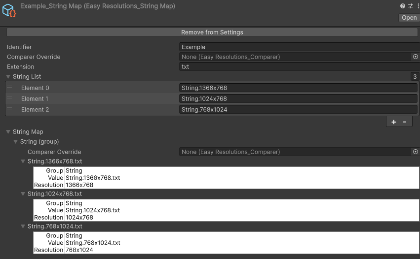
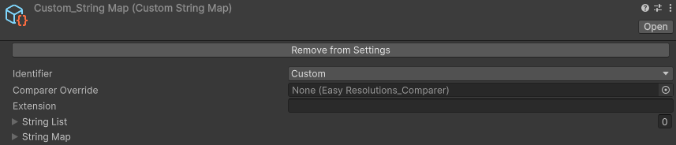

Easy Resolutions for Unity
===


An asset for the Unity Game Engine.

Automatically selects the appropriate scene based on screen resolution.

Particularly well-suited for games that aim to support a wide range of devices with varying scene resolutions, aspect ratios, and memory capacities by offering different UI/2D graphics layouts.


## License

[MIT](LICENSE.md)


## Installation

### Package Manager

Open the Unity Package Manager, click the `+` button, select `Install package from git URL...`, and paste the following URL: `https://github.com/marked-one/EasyResolutions.git`

Alternatively, you can use a versioned URL, e.g.: `https://github.com/marked-one/EasyResolutions.git#2.0.0`.

### Asset Store

Can be downloaded from Unity Asset Store: https://assetstore.unity.com/packages/tools/utilities/easy-resolutions-21478

Note that in this case it is distributed under the [Unity Asset Store EULA](https://unity.com/legal/as-terms).

## Samples

You can find few samples in the Samples tab in the Package Manager:




## Getting started

### 1. Create the Easy Resolutions Settings Asset

Choose one of the following methods:

- Right-click in the Project window and select `Create -> Easy Resolutions -> Settings`.
- In the main menu, navigate to `Assets -> Create -> Easy Resolutions -> Settings`.
- In the main menu, navigate to `Tools -> Easy Resolutions -> Create Settings`.

You can name this asset however you like and place it anywhere in the Assets folder or even within a UPM package.


### 2. Add the Easy Resolutions Settings Asset to Preloaded Assets

There are two ways to do this:

- Select the created Settings asset and click `Add to Preloaded Assets` button.
- Open `Edit -> Project Settings`, go to Player, find Preloaded Assets under the Optimization section in Other Settings, increase the Size field, and drag the asset into the new slot in the list.

At this point, Easy Resolutions is set up and ready to use.


### 3. Add the stub Scene

For automated resolution selection for the Starting Scene, Easy Resolutions requires a stub scene at index 0 in the Scene List in `File -> Build Profiles` (the reason is that Unity always loads the scene at index 0 in Build).

There are two options here:
- add the `Packages/com.vklubkov.easyresolutions/Assets/ZeroScene` as the scene at index 0
- add your own scene


### 4. Create your other Scenes and name them properly

Easy Resolutions expects scene names to follow this pattern:

`<path>/<name>.<width>x<height>`

For example:

`Assets/Scenes/SampleScene.1920x1080`

The scene name is parsed into a group key (`Assets/Scenes/SampleScene`) and a resolution. The resolution must be appended as a dot-separated suffix.

🚫 Incorrect:

`Assets/Scenes/Sample.1920x1080.Scene`

✅ Correct:

`Assets/Scenes/SampleScene.1920x1080`

Create multiple versions of the same scene with different resolution suffixes:

- `Assets/Scenes/SampleScene.1920x1080`
- `Assets/Scenes/SampleScene.1024x768`
- `Assets/Scenes/SampleScene.1366x768`

Add these scenes to the Scene List in `File -> Build Profiles`, below `ZeroScene`. 


### 5. Set the Starting Scene

Go to the Settings asset and select `Scenes/SampleScene` from the `Starting Scene (group)` dropdown.


### 6. Enable Resolution selection in the Editor

Select the Settings asset and enable `Run Starting Scene instead of Active Scene`. This will make your scenes run in Editor like in a build, starting with the scene at index 0, and then automatically switching to `Scenes/SampleScene` with picked resolution.


## Documentation

### Settings asset



#### Add to Preloaded Assets / Remove from Preloaded Assets

The Easy Resolutions Settings asset is available at runtime and for certain Editor features only when it is included in Preloaded Assets. This button simplifies adding or removing it from the Preloaded Assets list.

#### Editor Settings

- **Build Player Processor Order** - sets the execution order of Easy Resolutions' BuildPlayerProcessor callback, which updates the scene list before building.


- **Run Starting Scene Instead Of Active Scene** - when enabled, Easy Resolutions loads the Starting Scene (the first scene in the Scene List in Build Profiles) instead of the currently open scene when entering Play Mode in the Editor.


- **Pick Resolution For Active Scene** - when enabled, Easy Resolutions selects the appropriate resolution if currently active scene is loaded when entering Play Mode.

#### Runtime Settings

- **Default Comparer** - used to sort resolutions. If no other comparers are set, this serves as the fallback. Easy Resolutions automatically assigns a default comparer, but you can replace it.

  To create a Comparer asset:

  - Right-click in the Project window and select `Create -> Easy Resolutions -> Comparer`.
  - In the main menu, navigate to `Assets -> Create -> Easy Resolutions -> Comparer`.
  - In the main menu, navigate to `Tools -> Easy Resolutions -> Create Comparer`.


- **Epsilon For Aspect Ratio Comparison** - some resolutions result in slightly inaccurate aspect ratios (e.g., 16:9 screens are known for this). A tolerance value is needed for accurate comparisons. `0.008` is a good default, but you can adjust it if necessary.


- **Zero Scene** - displays the path to the scene at index 0 in the Scene List under `File -> Build Profiles`. Easy Resolutions provides a default Zero Scene at `Packages/com.vklubkov.easyresolutions/Assets/ZeroScene`, but you can use your own.


- **Starting Scene (group)** - specifies which group is loaded as the Starting Scene. In Unity, the scene at index 0 is always loaded first in the Build, with no direct way to override this behavior. The Starting Scene is automatically loaded after this initial scene. If you select here a group that points to Zero Scene (i.e., only contains Zero Scene), Easy Resolutions interprets this as an intention to load only the Zero Scene. In this case, you are responsible for handling navigation from it.


- **Scene Map** - displays scenes from Build Profiles as a map of grouped scenes, where multiple scenes share the same prefix but have different resolutions. You can assign a Comparer Override here, or leave it empty to use the Default Comparer.


- **String Maps** - while Easy Resolutions' main purpose is to select scene resolutions, it can also pick resolutions for any string. You can configure this through code or via adding String Map assets here.

  To create a String Map asset:

  - Right-click in the Project window and select `Create -> Easy Resolutions -> String Map`.
  - In the main menu, navigate to `Assets -> Create -> Easy Resolutions -> String Map`.
  - In the main menu, navigate to `Tools -> Easy Resolutions -> Create String Map`.


### Comparer asset



- **Prefer Aspect Over Resolution** - when enabled, Easy Resolutions prioritizes aspect ratio over resolution in comparison. Otherwise, resolution is considered to have more value.


- **Respect Orientation** - when enabled, resolutions with the same orientation are preferred over those with the same aspect ratio.


- **Resolution Preference** - determines whether Easy Resolutions selects a larger, smaller, or any closest resolution. Options:
  - Closest - selects the closest resolution
  - Closest Larger - prefers the closest larger resolutions
  - Closest Smaller - prefers the closest smaller resolutions

#### Custom comparer

You can create custom comparers, for example:

```csharp
using EasyResolutions;
using UnityEngine;

[CreateAssetMenu(fileName = "Custom Comparer", menuName = "Easy Resolutions/Custom Comparer")]
public class CustomComparer : EasyResolutionsComparer {
    public override double Epsilon { protected get; set; } // For aspect comparison, set from outside.
    public override (int Width, int Height) Target { protected get; set; } // Target resolution, set from outside.
    
    public override int Compare(IResolution a, IResolution b) { 
        // Custom comparer logic.

        ...

        // Should return:
        // -1 if 'a' is better,
        // 1 if 'b' is better,
        // 0 if they are equal.
        return 0;
    }
}
```

To create a Custom Comparer asset, use one of the following methods:

- Right-click in the Project window and select `Create -> Easy Resolutions -> Custom Comparer`.
- In the main menu, navigate to `Assets -> Create -> Easy Resolutions -> Custom Comparer`.
- 

### String Map asset



- **Identifier** - used at runtime to distinguish between different String Maps.


- **Comparer Override** - overrides the comparer for this String Map. If left empty, defaults to the default comparer of Easy Resolutions.


- **Extension** - an optional file extension. If the strings in the String List have an extension, specify it here so resolutions are parsed correctly. If the strings don’t have an extension, or if the extension doesn't match, the one specified here is appended. If left empty, no extension is considered. You can see how strings are parsed in the String Map foldout.


- **String List** - a list of strings that are parsed into a String Map and selected based on resolution. This list should not contain duplicates.


- **String Map** - displays strings from the String List as a map of grouped strings, where multiple strings share the same prefix but have different resolutions. It also includes the Comparer Override field, which is empty by default. If left empty, the String Map Comparer Override is used; if that is also empty, the Default Comparer from Easy Resolutions Settings is applied.

#### String Maps with a custom Identifier type

Instead of relying on the default string Identifier, you can use a custom type. For example:

```csharp
using EasyResolutions;
using UnityEngine;

public enum StringMapIdentifier {
    Custom
}

[CreateAssetMenu(fileName = "Custom String Map", menuName = "Easy Resolutions/Custom String Map")]
public class CustomStringMap : EasyResolutionsStringMap<StringMapIdentifier> { }
```

With this code, you can create Custom Scene Map assets using one of the following methods:
- Right-click in the Project window and select `Create -> Easy Resolutions -> Custom String Map`.
- In the main menu, navigate to `Assets -> Create -> Easy Resolutions -> Custom String Map`.

This creates a String Map asset where the Identifier can be selected from an enum dropdown:



### EasyResolutionsPicker

A class that provides runtime extension methods:

#### Adding Scenes

`public static void AddScenes(List<string> scenes)`

A non-extension static method used to add new scenes, including those in Asset Bundles.

**Usage:**
```csharp
var scenes = new List<string>();
scenes.Add(...);
...
EasyResolutionsPicker.AddScenes(scenes);
```

#### Picking a Resolution for a Scene

```csharp
public static string PickResolution<T>(this string source, T identifier)
public static string PickResolution<T>(this string source, T identifier, int targetWidth, int targetHeight)
public static string PickResolution<T>(this string source, T identifier, IEasyResolutionsComparer overrideComparer)
public static string PickResolution<T>(this string source, T identifier, int targetWidth, int targetHeight, IEasyResolutionsComparer overrideComparer)
```

These extension methods return the scene path that best matches the current or specified resolution.

**Usage:**
```csharp
[SerializeField] EasyResolutions_Comparer _customComparer;

...

var pickedScene = SceneManager.LoadScene("Scenes/SampleScene".PickResolution());
var pickedScene = SceneManager.LoadScene("Scenes/SampleScene".PickResolution(1920, 1080));
var pickedScene = SceneManager.LoadScene("Scenes/SampleScene".PickResolution(_customComparer));
var pickedScene = SceneManager.LoadScene("Scenes/SampleScene".PickResolution(1920, 1080, _customComparer));
```

#### Picking a Resolution from a String Map

```csharp
public static string PickResolution<T>(this string source, T identifier)
public static string PickResolution<T>(this string source, T identifier, int targetWidth, int targetHeight)
public static string PickResolution<T>(this string source, T identifier, IEasyResolutionsComparer overrideComparer)
public static string PickResolution<T>(this string source, T identifier, int targetWidth, int targetHeight, IEasyResolutionsComparer overrideComparer)
```

These extension methods select a string from a String Map group that best matches the specified resolution.

**Usage:**
```csharp
[SerializedField] EasyResolutions_Comparer _customComparer;
  
...

var pickedString = "String".PickResolution("Example");
var pickedString = "String".PickResolution("Example", 1920, 1080);
var pickedString = "String".PickResolution("Example", _customComparer);
var pickedString = "String".PickResolution("Example", 1920, 1080, _customComparer);
```
    
#### Picking a Resolution from a Custom String Dictionary

```csharp
public static string PickResolution(this string source, Dictionary<string, List<IParsedString>> stringMap, string extension = "unity")
public static string PickResolution(this string source, int targetWidth, int targetHeight, Dictionary<string, List<IParsedString>> stringMap, string extension = "unity")
public static string PickResolution(this string source, IEasyResolutionsComparer overrideComparer, Dictionary<string, List<IParsedString>> stringMap, string extension = "unity")
public static string PickResolution(this string source, int targetWidth, int targetHeight, IEasyResolutionsComparer overrideComparer, Dictionary<string, List<IParsedString>> stringMap, string extension = "unity")
```

These extension methods select a string from the specified String Dictionary that best matches the given resolution.

**Usage:**
```csharp
var stringMap = new Dictionary<string, List<IParsedString>();
var group = new List<ParsedString>();
group.Add(new ParsedString("String.1366x768", string.Empty));
group.Add(new ParsedString("String.1024x768", string.Empty));
group.Add(new ParsedString("String.768x1024", string.Empty));
stringMap.Add(group[0].Group, group);
  
var pickedString = "String".PickResolution(stringMap);
var pickedString = "String".PickResolution(1920, 1080, stringMap);
var pickedString = "String".PickResolution(_customComparer, stringMap);
var pickedString = "String".PickResolution(1920, 1080, _customComparer, stringMap);
```

### Dependency Injection

If your project uses Dependency Injection, extension methods may introduce unwanted coupling. To handle this, Easy Resolutions provides the EasyResolutionsPickerAdapter, which implements the IEasyResolutionsPicker interface.
